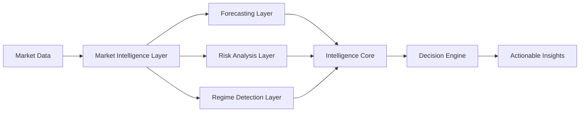
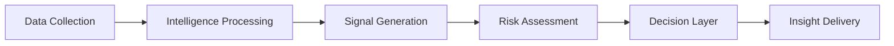

Research Paper on this project:- https://ieeexplore.ieee.org/document/11466047
<div align="center">

# ₿ Bitcoin Alpha System

### AI-Powered Market Intelligence for Digital Asset Markets

<p align="center">
  
  
  
  
  
</p>

### Turning Complex Market Data Into Actionable Intelligence

---

*Designed to identify market opportunities through advanced forecasting, regime analysis, and decision intelligence.*

</div>

---

# Overview

Bitcoin Alpha System is a next-generation market intelligence platform built to analyze digital asset markets through a multi-layer forecasting architecture.

The platform continuously evaluates market conditions, participant behavior, liquidity environments, and broader economic factors to generate high-confidence market intelligence.

Rather than focusing solely on predicting price, the system is designed to answer a more important question:

> **Is there an opportunity worth acting on?**

This philosophy enables the platform to prioritize decision quality, risk awareness, and market context over simple directional forecasting.

---

# Vision

Financial markets generate enormous amounts of information every second.

Most participants focus on isolated indicators.

Bitcoin Alpha System is built around a different idea:

### Market intelligence emerges from combining multiple perspectives.

The platform integrates diverse information streams into a unified intelligence framework capable of identifying:

- Emerging trends
- Market regime shifts
- Risk conditions
- Liquidity transitions
- High-conviction opportunities

---

# Core Capabilities

### Market Intelligence

Transform raw market information into actionable insights.

### Forecasting

Generate forward-looking assessments of market conditions.

### Regime Analysis

Identify changing market environments before they become obvious.

### Risk Awareness

Evaluate uncertainty and confidence before decisions are made.

### Decision Intelligence

Convert complex data into understandable signals and recommendations.

---

# High-Level Architecture



---

# Intelligence Framework

The platform is built around multiple specialized analytical engines.

Each engine focuses on a different dimension of market behavior.

### Forecasting Intelligence

Analyzes evolving market dynamics and directional tendencies.

### Risk Intelligence

Evaluates uncertainty, volatility conditions, and market stability.

### Positioning Intelligence

Monitors participant behavior and structural market activity.

### Network Intelligence

Measures ecosystem-level strength and activity.

### Macro Intelligence

Tracks broader economic and liquidity conditions.

### Decision Intelligence

Synthesizes information into actionable outcomes.

---

# Product Philosophy

Many forecasting systems attempt to predict where the market will go.

Bitcoin Alpha System focuses on determining:

- Whether an opportunity exists
- Whether risk is justified
- Whether confidence is sufficient
- Whether action should be taken

The goal is not more predictions.

The goal is better decisions.

---

# Workflow



---

# Key Features

### Multi-Layer Analysis

Combines independent intelligence systems into a unified framework.

### Regime Awareness

Designed to adapt to changing market conditions.

### Confidence-Driven Decisions

Signals are generated only when confidence criteria are satisfied.

### Continuous Learning

Architecture supports ongoing model evolution and research.

### Scalable Design

Built for future expansion across additional assets and markets.

---

# Technology Stack

## Data & Analytics

- Python
- Pandas
- NumPy
- Polars

## Machine Learning

- PyTorch
- TensorFlow
- Scikit-Learn

## Visualization

- Plotly
- Streamlit

## Infrastructure

- Docker
- GitHub Actions

---

# Dashboard

The platform includes a visualization layer designed to provide:

- Market Overview
- Intelligence Monitoring
- Confidence Tracking
- Regime Analysis
- Signal History
- Research Insights

---

# Use Cases

### Traders

Support discretionary decision-making with data-driven intelligence.

### Researchers

Explore market structure and forecasting methodologies.

### Analysts

Monitor evolving market conditions.

### Institutions

Integrate intelligence into broader investment workflows.

---

# Research & Development

Bitcoin Alpha System is an actively evolving research platform.

Current development focuses on:

- Advanced forecasting systems
- Adaptive intelligence frameworks
- Automated research pipelines
- Enhanced risk modeling
- Scalable decision architectures

---

# Roadmap

## Current

- [x] Market Intelligence Framework
- [x] Forecasting Infrastructure
- [x] Regime Analysis
- [x] Risk Assessment Layer

## Future

- [ ] Institutional Dashboard
- [ ] API Platform
- [ ] Real-Time Intelligence Engine
- [ ] Multi-Asset Support
- [ ] Portfolio Intelligence
- [ ] Enterprise Integrations
- [ ] AI Research Assistant
- [ ] SaaS Platform

---

# Repository Structure

```text
bitcoin-alpha-system/

├── data/
├── processed/
├── src/
├── dashboard/
├── reports/
├── research/
├── infrastructure/
└── documentation/
```

---

# Security & Intellectual Property

Certain implementation details, forecasting methodologies, and decision-generation processes remain proprietary.

The public repository is intended to showcase the platform architecture, research direction, and product vision while protecting core intellectual property.

---

# Contributing

Contributions, suggestions, and discussions are welcome.

Areas of interest include:

- Data Engineering
- Visualization
- Infrastructure
- Research Tooling
- Platform Development
- Documentation

---

# Long-Term Mission

Our mission is to build an intelligent decision-support platform capable of transforming complex market data into clear, actionable intelligence.

The future of investing is not more information.

The future is better intelligence.

---

<div align="center">

## ₿ Bitcoin Alpha System

### AI-Powered Market Intelligence

Building the next generation of decision intelligence for digital asset markets.

⭐ Star the repository if you find the project interesting.

</div>
The above uploaded is Model v1.
The Alpha Model v2 and Research Paper will be open sourced shortly , as soon as the testing is done fully.

- Here is a sneak peek at the model v2 performance:


