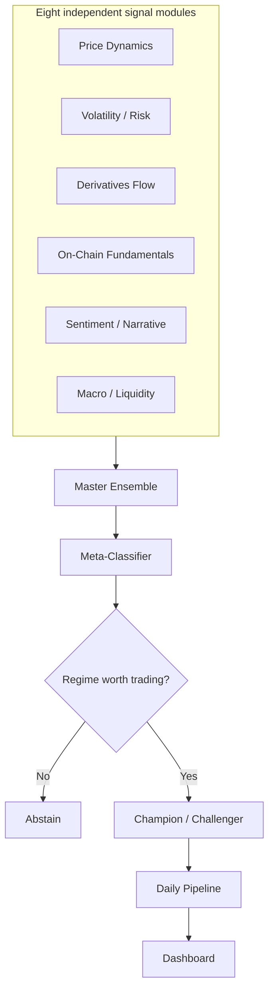

# Bitcoin Alpha System

```
PAPER   IEEE ICIPTM 2026 — Regime-Aware Meta-Learning for Selective Directional Trading
MODELS  8 signal modules -> master ensemble -> meta-classifier -> champion/challenger
STATUS  architecture implemented, out-of-sample validation in progress
```

[](https://www.python.org/)
[](https://pytorch.org/)
[](https://doi.org/10.1109/ICIPTM69057.2026.11466047)

A regime-aware meta-learning system for BTC markets, implementing the architecture from
*A Regime-Aware Meta-Learning Framework for Selective Directional Trading in Cryptocurrency
Markets* (IEEE, 2026): eight independent signal modules feeding a master ensemble, a
meta-classifier that decides whether the current regime is even worth trading, and a
champion/challenger harness to compare candidate models honestly against each other.

---

## Contents

- [How it fits together](#how-it-fits-together)
- [The eight signal modules](#the-eight-signal-modules)
- [Champion / challenger](#champion--challenger)
- [Daily pipeline](#daily-pipeline)
- [Dashboard](#dashboard)
- [Validation status](#validation-status)
- [Research paper](#research-paper)
- [Quick start](#quick-start)
- [Project structure](#project-structure)
- [Limitations](#limitations)
- [License status](#license-status)

---

## How it fits together



The meta-classifier's job is narrower than "predict the price" — its actual output is closer to
*is this a regime where a directional bet is even justified*, which is the abstention mechanic
the published paper is built around.

## The eight signal modules

| Module | Folder | What it evaluates |
|---|---|---|
| 01 | `model_1_price_dynamics` | Price action and momentum structure |
| 02 | `model_2_volatility_risk` | Volatility regime and risk conditions |
| 03 | `model_3_derivatives_flow` | Futures/options positioning and derivatives-market flow |
| 04 | `model_4_onchain_fundamentals` | On-chain activity — transaction volume, miner behavior, network usage |
| 05 | `model_5_sentiment_narrative` | Sentiment and narrative signals around the asset |
| 06 | `model_6_macro_liquidity` | Broader macro and liquidity conditions |
| 07 | `model7_master_ensemble` | Combines all six signal modules into a unified view |
| 08 | `model8_meta_classifier` | Decides regime and confidence; gates whether a trade is justified at all |

Each module is independently swappable — the ensemble layer is what makes this a system rather
than six unrelated scripts.

## Champion / challenger

`champion_challenger/` holds the harness that lets a new candidate model prove itself against
the currently deployed one on shared data before it's allowed to replace it. Nothing gets
promoted on vibes — a challenger has to actually beat the champion on the same evaluation
window first.

## Daily pipeline

`run_daily_pipeline.py` runs the full chain end to end: pull fresh data, run it through all
eight signal modules, combine through the ensemble and meta-classifier, and log the resulting
decision. This is the same code path used whether you're backtesting historically or running
against today's data — one pipeline, not a research version and a separate production version
that can quietly drift apart from each other.

## Dashboard

`dashboard/` visualizes what the pipeline is actually doing day to day — signal history,
regime classification over time, and champion vs. challenger comparisons — rather than
requiring you to read logs to know what the system decided and why.

## Validation status

The architecture above is implemented and running. A rigorous walk-forward and out-of-sample
validation pass is in progress, and no performance number is being published in this README
until it's been through that process — a number quoted before validation is complete is worse
than no number at all, since it can't yet be distinguished from noise. Once results are
validated, they'll replace this section directly, with the methodology alongside them.

## Research paper

> **A Regime-Aware Meta-Learning Framework for Selective Directional Trading in Cryptocurrency Markets**
> Manav Sharma. IEEE, ICIPTM 2026. DOI: [10.1109/ICIPTM69057.2026.11466047](https://doi.org/10.1109/ICIPTM69057.2026.11466047)

Formalizes latent market-regime identification through unsupervised temporal clustering, paired
with a meta-learned classifier that abstains from trading when regime confidence is low rather
than forcing a directional guess. This repository is the applied implementation of that paper.

## Quick start

```bash
git clone https://github.com/manavmax/Bitcoin-Alpha-System
cd Bitcoin-Alpha-System
pip install -r requirements.txt

python run_daily_pipeline.py
```

<details>
<summary>Running an individual signal module in isolation</summary>

Each `model_N_*` folder is independently runnable against `data/raw/` for debugging or
inspecting a single signal without running the full ensemble — see that module's own `src/`
for its entry point.

</details>

## Project structure

```
Bitcoin-Alpha-System/
├── model_1_price_dynamics/
├── model_2_volatility_risk/
├── model_3_derivatives_flow/
├── model_4_onchain_fundamentals/
├── model_5_sentiment_narrative/src/
├── model_6_macro_liquidity/
├── model7_master_ensemble/
├── model8_meta_classifier/
├── champion_challenger/         candidate vs. deployed model comparison harness
├── dashboard/                   visualization layer
├── data/raw/
├── src/
└── run_daily_pipeline.py        single entry point, backtest and live share this code path
```

## Limitations

- This is a research system. Nothing here is investment advice or a claim of a validated,
  tradeable edge until the validation pass referenced above is complete.
- Each signal module is only as good as the data feeding it — on-chain and sentiment signals
  in particular are noisier and slower-moving than price/volatility signals, and the
  meta-classifier's abstention behavior exists specifically to handle that asymmetry.

## License status

No license has been selected yet.

---

**Colophon.** Manav Sharma, first author, IEEE ICIPTM 2026. If something here doesn't match the
code, open an issue — this file should describe what's actually running, not what's aspirational.
